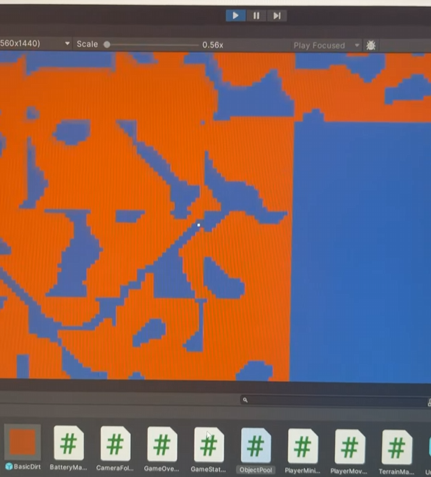

## Features

* Perlin noise terrain generation
* Chunk system which generatates terrain infinitely in all directions below y==0 (the surface) as the player moves
* Mine brown dirt blocks by running into them
* Battery for the drone ship that ticks down below the surface, then rapidly refills above the surface (as if by solar power)
* Object pooling design pattern to improve frame rate and reduce negative effects of garbage collector
* Game Over + New Game UI layer

## Screenshot

(Unity camera zoomed out for demonstration purposes; actual game would be zoomed in so player couldn't see chunk edges)

